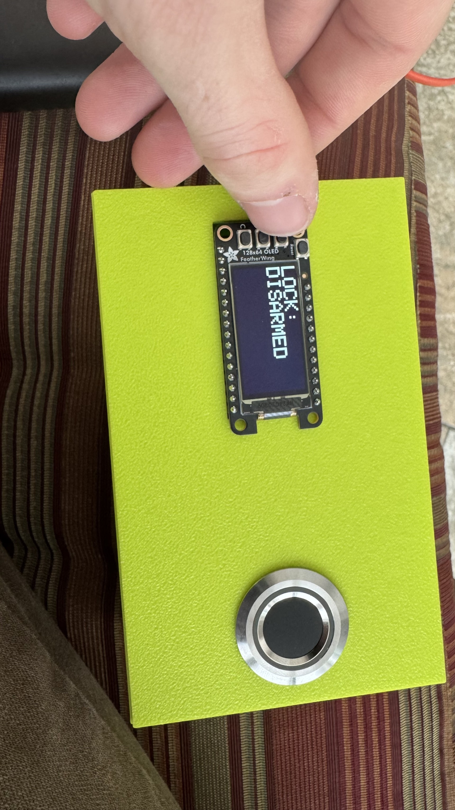
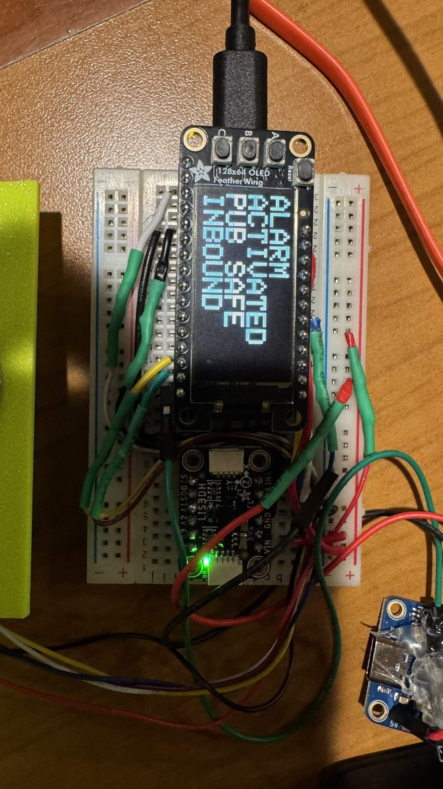

63# Bike Theft Prevention System

A proof-of-concept embedded system designed to deter bike theft, authenticate owners with biometrics, and provide location tracking after a theft event.

---

# Introduction

Our goal was to create a system for securing a bike that took less time to use than a traditional U- or cable lock. Bike theft is a serious problem on Middlebury campus, with it happening to people we know or ourselves often. This is a problem at Universities across America as well.¹ At the same time, traditional locks are a hassle to use when moving around campus as much as the average student, and many students tend to not lock their bikes, making the issue worse.¹ Out goal was to make a bike theft deterent that would require little work to operate, and strongly discourage bike theft. We determined the best solution to this problem would utilize a microcontroller to manage an array of theft deterent and retreival methods.

In order to lock and unlock the bike, we determined that a fingerprint scanner would be ideal for a quick and easy lock and unlock without having to manage a physical aspect. An accellerometer would detect when the bike was stolen, by measuring when the bike was moving while locked. Once the system determined a theft attempt was underway, it would activate a loud alarm, similar in volume to a car horn, and track the bike's location via an onboard GPS. An MQTT server would receive information from the device and display it to the owner. An OLED display would inform the user as to the lock status, battery, and provide information on the fingerprint registration system.

Originally, we were interested in a physical lock mechanism as well, but we realized that it would be easier and just as effective to use a horn. What is especially nice about this approach is that a bike may be secured regardless of where it is, without having to rely on a bike rack.

---

# Methods

## MCU

We used the Huzzah32 ESP32 Feather by Adafruit due to its WiFi and deep sleep capabilities, and because it we already had on hand. We used PlatformIO to build the structure of our project. We use I2C, SPI, and UART protocols to communicate with our array of sensors and peripherals. The ESP32 uses a MOSFET to control a horn wired to a 12V power source. We also make effective use of the ESP32's dual core. Our sensor loops are handled as FreeRTOS tasks which allow us to spread out CPU load and ensure our code is non-blocking. 

---

## Peripherals

### Fingerprint Scanner

We are using Adafruit's "Rugged Panel Mount Fingerprint Sensor with Bi-Color LED Ring - R503" as our fingerprint sensor. The sensor exchanges data with the MCU on the RX and TX pins, as well as a separate interrupt pin for wakeup. With onboard memory, the sensor manages all fingerprint reading, verification, and storage internally.² The red, pink, and blue LED ring is configured to show when the system is woken via the sensor. It also indicates if a scan is read as a match, and, with the OLED, walks the user through enrolling a new fingerprint. 

---

### Accelerometer

We are using Adafruit's LIS3DH acceleromter. It features high sensitiviy, 3-axis detection, and low-power modes. It also can be configured to supply an interrupt when a certain threshold of motion is setup.³ Our acceleromter is primarly used to wake up our system. When the acceleromter detects a threshold of motion, it will trigger the ESP32 wakeup process. Once the interrupt is triggered, the acceleromter moves into a higher-power mode, where it reads for acceleration more frequently. New acceleration events will reset the ESP32 sleep timer. It is wired using I2C.

---

### Horn

The horn is intended to by supplied with a 12v power supply, as opposed to the 5v that the MCU expects. For this reason, we purchased a regulator and MOSFET, and purchased a 12v battery. The voltage is regulated down to 5v for the MCU, and the MCU controls the horn indirectly, via the MOSFET. The MOSFET allows the MCU to allow or disallow current to the horn without directly supplying the current at the level the horn expects.

---

### GPS

The GPS is connected via its RX pin to the MCU, which makes up half of an SPI connection. In the issues section this will be explained. As it stands, the GPS provides data in the form of coordinates. When the MCU wakes up, its begins reading from the GPS sensor, which sends it data in the National Marine Electronics Association (NMEA) data format. This is then parsed using an Adafruit library, and stored at the initial wakeup of the ESP32. Before the ESP32 timer expires, it checks the GPS data again and determines if the system has been moved more than a threshold distance (in our case, 15ft). If this threshold is exceeded, then the ESP32 moves into the alarm state.

---

### OLED Display

We decided on the Adafruit 128x64 OLED FeatherWing due to its ability to connect to the MCU easily, its simple input system, and modest graphical capabilities, being limited to black and white.

The display is used to give the user information, and its three input buttons are used for the user to communicate to the system. It physically acts as a wing to the MCU, sitting directly on it. It communicates via SPI, and uses the adafruit SH110X graphics drivers. The adafruit GFX library provides commands to display text, and images.

Typically, the monochrome screen is blank. When the A button is pressed, it displays the battery charge and lock/unlock status. The B button enrolls a fingerprint, assuming the device is unlocked. The C button displays the GPS status, giving the current connected satelite number and coordinates. When the device goes to sleep, the screen will become blank as it powers down.

We referenced the code provided by the device supplier to write our code for the display.⁴

---

[Wiring Diagram Here](images/wiringDiagram.pdf)

---

## Bill of Materials

| Item                | Supplier | Cost    | Store link |
|---------------------|----------|---------|------------|
| Huzzah32 MCU        | Adafruit | 21.95   | https://www.adafruit.com/product/3619 |
| Fingerprint sensor  | Adafruit | $39.95  | https://www.adafruit.com/product/4651 |
| Feather OLED        | Adafruit | $15.95  | https://www.adafruit.com/product/6313 |
| GPS Module          | Adafruit | $29.95  | https://www.adafruit.com/product/4279 |
| Car Horn            | Amazon   | $12.99  | https://www.amazon.com/dp/B08B4LTRJX  |
| Battery Pack        | Amazon   | $18.56  | https://www.amazon.com/dp/B09DP9D8Q4  |
| Accelerometer       | Adafruit | $4.95   | https://www.adafruit.com/product/2809 |
| Regulator           | Adafruit | $1.25   | https://www.adafruit.com/product/2165 |
| MOSFET              | Adafruit | $2.25   | https://www.adafruit.com/product/355  |
| **Total**           | —        | **$124.85** | |

---

# Results

Areas of success: Code works well, most periphreals function as intended.

Areas of failure: the horn doesn't currently work, and in addition to the form factor currently being unappealing, we have a functional proof of concept, but not a full device.

Here are the three main OLED screens, each activated with one of the three buttons when the device is awake

As opposed to simply displaying information, this screen is associated with prompting the fingerprint scanner to enroll another fingerprint, so long as the device is unlocked.

The device recognizing a test theft event

---

# Accessibility

Although this product was designed with a bike in mind, there's no reason this product couldn't be used to secure any device that is intended to be secured. There are still some limitations in terms of accessibility, with the most prominent being the input device. The buttons are placed quite close together and labeled in very small text, so people with visual or motor disabilities may have trouble using it. Additionally, people with hearing disabilities would struggle to realize if they unintentionally set off the alarm, which may cause trouble for them or others in the area, given the volume of the horn.

---

# Ethical Implications

The volume of the horn is the most identifiable impact that the device could have on a local population, Although unlikely, there is a possibility that the device gets triggered when someone unlocks their bike and jostles the user's bike for an extended period of time. This would unnessecerily trigger a loud alarm. Whether unintentional or not, the horn going off may startle a thief and cause them harm if they crash the bike, and the local community may get aggrivated at the alarm sound.

---

# Schedule

Our original schedule was as follows:

Finger Print Authentication (~1 week)
We will begin by ensuring our FPA functions. This will consist of connecting the Fingerprint Sensor to our MCU and configuring it to verify certain finger profiles.

Accelerometer (~1 week)
We will need to configure the SPI communication to be able to read data from the accelerometer and determine when motion is detected

Horn & Battery configuration & wiring (~1 week)
Involves wiring the BTEDD through the MOSFET to the battery pack as well as using the Huzzah board to control power to the BTEDD

Wire the regulator from the Huzzah to the battery (~1 week)
We will next connect our Car Horn to the MCU. Since the car requires 12 volts, it will be connected through a MOSFET directly to the 12v battery

GPS detection (~1 week)
We will connect a GPS to the MCU, which will be usually sleeping. In the case of a BTE, it shall awaken, and will begin transmitting location data to the user through Adafruit IO. We are assuming the nature of the bike thief to be another student, so we will rely on campus Wi-Fi.

Adafruit IO Dashboard (~1 week)
We will use the IO dashboard example code to push GPS and other data to a dashboard we can view

OLED Display (~1 week)
We will use a small OLED display compatible with our MCU to indicate locking status as well as facilitate adding and deleting finger profiles. An LED will also be used as a more visible armed/disarmed indicator (Danny)

---
Due to the limitation of time we had to complete the project, the actual schedule went as follows:

Accelerometer (2 days)

GPS detection (2 days)

Adafruit IO Dashboard (2 days)

Finger Print Authentication (3 days)

OLED Display (1 day)

Horn & Battery configuration & wiring (~1 week)

Wire the regulator from the Huzzah to the battery (1 day)

We worked mostly asynchroniously on different tasks, but this was the general order in which tasks were completed. We had multiple problems with the horn and battery configuration, detailed below.

---

# Issues

The first major issue we encountered was that the GPS module didn't directly have a TX and RX line, which make up an SPI connection interface. The model GPS we bought was intended to connect to a computer or rasberry pi via a USB-C port, and formatted its pin outputs in terms of the USB-C transmission protocol. We realized we had purchased the wrong model GPS, but we figured out that we could directly solder wires to the physical  GPS module, bypassing the conversion unit. Although the RX pin was soldered just fine, the delicate nature of the task resulted in the TX pin being ripped off of the module. This means that we can receive data from the GPS, which outputs constantly, but we can't send input to it. Ultimately, this doesn't affect the function of the product greatly.

When we integrated the code for the peripherals into the main code, it would output "invalid header" and get stuck in a boot loop. The same code functioned in Arduino IDE, so we had to do a lot of work to figure out why PlatformIO was struggling. The problem was with library versions, as in PlatformIO, we had the wrong library version. Arduino had the newest versions, so we had to manually update the libraries in PlatformIO.

Due to the large number of sensors that need to work at the same time, we encountered performance issues. We solved this by creating "task" modules, which are asynchronously ran, which doesn't block the main code from running.

We are currently powering the system using TWO battery packs - the original 12v pack we ordered, and an extra 5v Anker portable charger we had. This is not our original plan, but we struggled to get the MCU successfully powered from pins, instead of the USB port. After researching, it is not recommended to power the board from the pinout at all. 

A primary problem we encountered was getting out horn to work. Since the intensity of the of the horn is integral to the effectiveness of the project, we chose a 12 volt horn. This adds a complication to our whole system, as the rest of our units work at 5v. Since we were initially hoping to use only one power source, we got a 12v battery, a voltage regulator, and a MOSFET. Theoretically, we connect 12v power to the horn, and also run 12v into the regulator. We put the ground through the MOSFET, controlled by a 5v signal, either opening or closing the circuit. The most difficult part here being able to toggle the horn. In an initial test, it worked briefly, only blaring when we wished and then began to spark. Although not positive, we believed to have accidentally blown out the MOSFET. In later tests with a new MOSFET, we were able to make a circuit that controlled the horn with a small button. However, after disassembling this circuit to solder a more finalized version, we have not been able to get the horn to work again. We have verified that the horn still independently blares if connected directly to power, and we have measured the voltage and amperage being output to the horn. Unfortunately, we are reading 12v and 3a, so we are still unsure why the horn is not functioning.

---

# Future work

The form factor of our finished product is not ideal for actual applications. It works as a proof of concept, but ideally the device would fit inside the hollow internal tubes of the bike frame. As it stands, a neon box will realistically be a target for thieves.

As it stands, the user will have to access the Adafruit IO dashboard via the website, but ideally for ease of use we could port the data over to an app.

---

# References

1. Simmons, T. (2025, December 10). IUPD deploying “bait bikes” to fight back against campus bicycle thefts. WRTV Indianapolis. https://www.wrtv.com/news/local-news/in-your-community/monroe-county/iupd-deploying-bait-bikes-to-fight-back-against-campus-bicycle-thefts

2. Hangzhou Grow Technology. (2019). R503 Fingerprint Module User Manual. https://cdn-shop.adafruit.com/product-files/4651/4651_R503%20fingerprint%20module%20user%20manual.pdf

3. STMicroelectronics. (2011). AN3308 Application note. https://cdn-shop.adafruit.com/datasheets/LIS3DHappnote.pdf 

4. Adafruit (2020) 128x64 OLED FeatherWing [Example code]. https://learn.adafruit.com/adafruit-128x64-oled-featherwing/arduino-code

